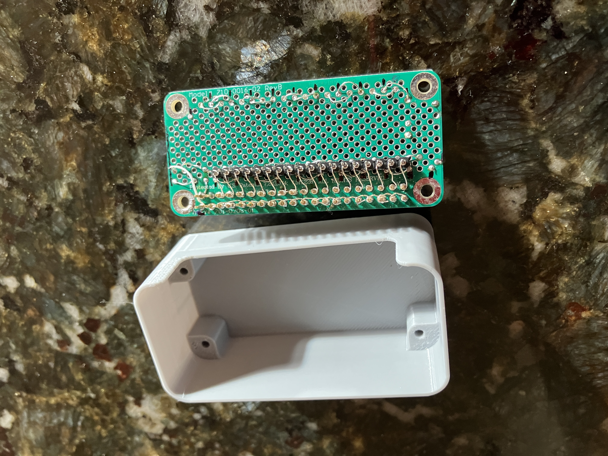

# Board construction

A long time ago I got a little crush on a now-ancient electronics assembly
technique, wire wrapping, where cute little tools neatly wrap cute little
interconnect wires between square-edged pins. Like those of the 40-pin header
I'm using here. Wire wrapping was never especially obscure but it caught my
fancy and I accumulated a few tools - none of which work especially well, but
it's fun every once in a while to build something with them and feel kinship
with the hoards of underpaid women who assembled the Apollo guidance
computers and their core memory modules, among other things.

Here I had a moderate number of interconnects to make, too few to do it the
Modern Way of modeling the board in Fusion and letting a fabrication shop send
me a loss-leader sample but too many to love the idea of running individual bits
of wire by hand - so I ran individual bits of wire by hand with the help of my
little tools.

If you squint you can see plenty of places I broke the interconnect wire, I'm
burning enough time here as it is and don't need to chase cosmetic perfection,
but running those header interconnects took way less time than threading the Vcc
and GND bus wires around the board and soldering them in place.

Apparently, done right, wire-wrapped connections using insulated interconnect
wire are gas-tight and last decades without corrosion. I've never figured out
how to make connections reliably with the scrounged tools I have on hand, so
generally strip the wires first and probably give up this desireable
lives-forever property. But I have some similar assemblies many years old still
functioning.

Besides not yet having populated the board with the actual 1W nodes I want to
test bus-master software against, I haven't yet arranged to install a small
FET for the strong pullup function required by some 1W nodes during some
operations. I'll update this para when that's done.
