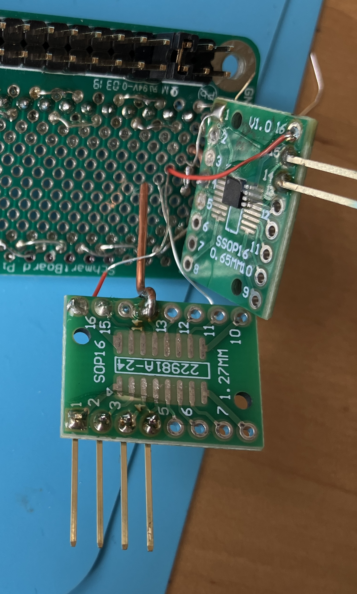

# Populating the bus

One-wire devices are individually laser-inscribed with a purportedly unique "ROM code" that serves as a bus address. It's presented on the wire as an eight bit family code, six bytes of address, and eight more bits of CRC.

The family code seems to map to differences in protocol details and to support of distinguishing features. For example, my read of the data sheet for the MAX30207, family code 0x54, suggests the device doesn't start converting analog temperature to a digital output value until the host reads a 16-bit CRC the device sends after receiving the 0x44 CONVERT TEMPERATURE command. Every other device I've looked at begins converting the temperature immediately.

Motivated in part by this seeming oddness, I wanted representatives of as many 1W "families" as reasonably possible, to test drivers for various functions of each. The things are cheap, but I didn't pay enough attention to the packaging specs when ordering eight of them and ended up with two bare chips so small I lost them while peeling open their tape/reel carriers. They're somewhere near my workbench, likely embedded in the wood flooring by the wheels on my sitting stool.

One of the tiny packages I successfully got soldered to copper whiskers and then encased in a drop of epoxy for strain relief, but it didn't function when tested. I think it's likely I overheated it while soldering. Three more (less microscopic) I matched up to SM prototype boards I had on hand. I used heavy wires for ground and a no-connect intertie to give these some structure. Two more devices were in through-hole packages, so I could solder them onto the test harness directly.

Adjacent parts are crammed in tight, so I used a conformal coating -ish Liquid Electrical Tape goop on some of the conductive bits to reduce the likelihood of shorts. The same stuff can (barely) be seen here covering the bus weaves I did in the base board.

Here are the devices as populated, by jumper position (left to right with the pins closest to you):

| Position   | Device | Family | Address |
| --------   | ------ | ------ | ------- |
|  1 (20-21) | DS28EA00 |  42h  | 3a-ac-7e-00-00-00 |
|  2 (19-22) | TMP1826 | 26h | 2f-ca-47-30-08-44 |
|  3 (18-23) | DS18S20 | 10h | 6f-45-f1-03-08-00 |
|  4 (17-24) | DS1822Z | 22h | 8c-56-7d-00-00-00 |
|  5 (16-25) | MAX31820PAR | 28h | f7-37-4c-0f-00-00 |
|  6 (15-26) | TMP1827 | 27h | cooked soldering |
|  7 to 18   | as yet unused | | |

Two devices expose auxilliary pins. (One more device with auxilliary pins, the TMP1827, is the one I guess I cooked soldering to its 0.5mm-pitch pads by hand. Limit coffee to one cup.) "Front" here means closest to jumpers.

| Position  | Device   | Aux pins, front to back |
| --------  | ------   | ----------------------- |
| 1 (20-21) | DS28EA00 | PIOB, PIOA |
| 2 (19-22) | TMP1826  | IO2/ALERT-cmpl, IO1, IO0, IO3 |
